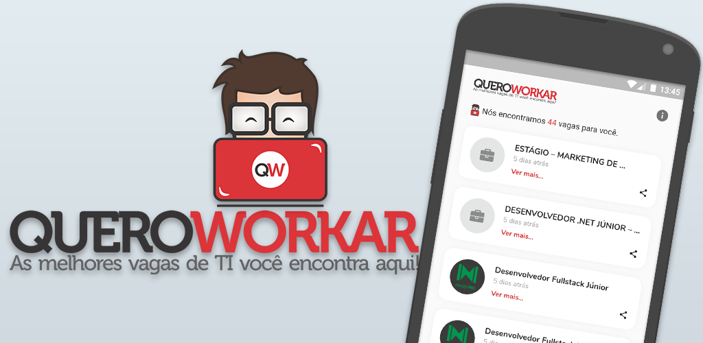

# Quero Workar - As melhores vagas de TI você encontra aqui!

O QueroWorkar é um aplicativo que aproxima, de forma prática e direta, profissionais e empresas.

Disponível na [PlayStore](https://play.google.com/store/apps/details?id=tech.robsonsilva.quero_workar)!



## Um pouco de história

Essa é a versão mobile da já conhecida plataforma que havia sido retirada do ar e que voltou recentemente graças ao Carlos Terceiro e a [Mobills](https://www.mobills.com.br/). Então resolvi desenvolver a aplicação para retribuir ao QueroWorkar e aplicar os conhecimentos que venho adquirindo em mobile, já que o QueroWorkar era a plataforma onde via as vagas quando comecei a estudar na área de desenvolvimento e sonhava trabalhar um dia. Me inspirei também na primeira versão desenvolvia pelo meu grande amigo Emerson Vieira e se você quiser saber ainda mais um pouco, basta conferir [esse](https://www.linkedin.com/posts/robsonsilv4_flutter-bloc-flutterando-activity-6642161887561736192-FDV4) e [esse](https://www.linkedin.com/posts/robsonsilv4_queroworkar-apps-on-google-play-activity-6644998985910145024-WKRK) outro post.

---

### Tecnologias e pacotes utilizados:

- [Dart](https://dart.dev/) como linguagem principal.
- [Flutter](https://flutter.dev/) como framework cross plataform.
- [GetIt](https://github.com/fluttercommunity/get_it) para injeção de dependência.
- [Dio](https://github.com/flutterchina/dio) para requisição web.
- [Dio HTTP Cache](https://github.com/hurshi/dio-http-cache) para cachear as requisções.
- [HTML](https://github.com/dart-lang/html) para tratamento das páginas.
- [Flutter HTML](https://github.com/Sub6Resources/flutter_html) para transformação de html em widgets.
- [Transparent Image](https://github.com/brianegan/transparent_image) para carregamento das imagens.
- [Loading](https://github.com/leonzone/loading) para animações de carregamento.
- [Bloc](https://github.com/felangel/bloc) para gerencimaneto de estado.
- [Flutter Bloc](https://pub.dev/packages/flutter_bloc) que são widgets do Bloc para Flutter.
- [Hydrated Bloc](https://github.com/felangel/hydrated_bloc) para sincronização de dados.
- [Equatable](https://github.com/felangel/equatable) para comparação de objetos.
- [Meta](https://pub.dev/packages/meta) para adição de paramêtros obrigatoórios.
- [Share](https://pub.dev/packages/share) para compartilhamento.

---

### Estrutura de pastas e arquivos:

```
lib:

│   main.dart
├───blocs/
│   │   app_bloc_delegate.dart
│   │   blocs.dart
│   │
│   └───jobs/
│           jobs.dart
│           jobs_bloc.dart
│           jobs_event.dart
│           jobs_state.dart
├───data/
│   ├───models/
│   │       job_model.dart
│   │
│   └───repositoires/
│           job_repository.dart
│
├───di/
│       service_locator.dart
├───shared/
│   ├───constants/
│   │       api.dart
│   │       images.dart
│   │       qw_theme.dart
│   │
│   └───widgets/
│           info_widget.dart
│           job_share.dart
│           loading_qw.dart
└───ui/
    └───pages/
        │   detail_page.dart
        │   splash_page.dart
        │
        └───home_page/
            │   home_page.dart
            │
            └───widgets/
                    jobs_quantity.dart
                    job_item.dart
```

---

## Como rodar o projeto

Primeiro você precisa clonar o repositório:

```sh
git clone https://github.com/robsonsilv4/queroworkar.git quero_workar
```

Agora basta entrar na pasta do projeto e baixar os pacotes:

```sh
cd esse repo

flutter packages get
```

E rodar no seu dispositivo:

```sh
flutter run
```

---

## Como gerar o instalador

Para gerar os instaladores, basta entrar na pasta do projeto e rodar o seguinte comando:

```sh
flutter build apk --split-per-abi

flutter install # para instalar no dispositivo ou emulador
```

Os arquivos gerados ficam em:

```sh
quero_workar/build/app/outputs/apk/release/...
```

---

## Como contribuir

Você pode contribuir para o projeto de qualquer maneira. Seja instalado o aplcativo e dando feedback, abrindo issues, melhorando ou trauduzindo a documentação, melhorando ou adicionando features, compartilhando ou falando sobre o projeto, doando ou de qualquer outra forma que conseguir. O importante é que assim como eu, você tenha uma boa experiência e aprenda algo.

---

## Contribuidores

Desenvolvido incialmente por [Robson Silva](https://github.com/robsonsilv4) com a ajuda dos seguintes [contribuidores](./CONTRIBUTORS.md).

---

## Licença

A licença utilizado no projeto é a MIT. Para mais detalhes leia o [arquivo](./LICENSE.md).

---

Ah, resolvi não adicionar propagandas no aplicativo, então, adoraria receber alguns cafézinhos pelo PicPay @robsonsilv4 😊.
E não se esqueçam de conferir também o site do [QueroWorkar](https://queroworkar.com.br/)!

---

Agradeço em especial ao Zarathon Maia ❤️ por ter me disponibilizado a conta de desenvolvedor e desejo a todos um ótimo café e bons estudos 🤓.

E isso é tudo pessoal!
